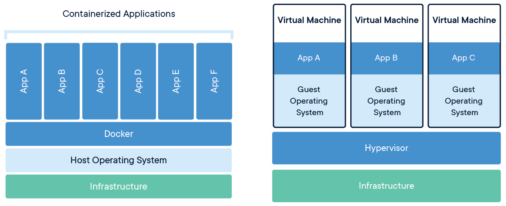
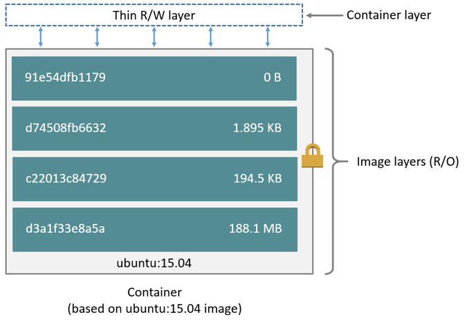

# Mastering Docker: A Comprehensive Guide to Containerization


Welcome to the world of Docker, where containerization has revolutionized the way we develop, deploy, and scale applications. Docker provides a lightweight and efficient platform for packaging software into self-contained units, making it easier to run applications consistently across different environments. In this article, I will guide you through the essential Docker vocabulary and commands, enabling you to create, inspect, and remove containers, networks, and data volumes. Additionally, we will explore advanced topics such as running Docker containers in different modes, connecting multiple containers, and sharing resources between containers and the host machine. Let's dive in!

[TOC]

## Getting Started 

Before diving into mastering Docker, it is helpful to have some prerequisite knowledge. Familiarity with basic command-line usage, containerization concepts, and an understanding of operating systems and networking principles will greatly benefit your journey in mastering Docker. Additionally, having a solid understanding of Linux-based systems and how software applications are deployed and managed will enhance your overall understanding and proficiency with Docker.

### Docker virtualization



Docker virtualization uses lightweight containers for efficient resource utilization and application-centric deployment. Traditional virtual machines rely on hypervisors for stronger isolation and full operating system virtualization. Docker is ideal for packaging and deploying applications, while traditional VMs are suitable for virtualizing entire servers or infrastructure components.

### Installing Docker

Before we embark on our Docker journey, let's install Docker on our system. I'll guide you through the installation process, ensuring you have a fully functional Docker environment.

#### Docker engine

For Linux/Unix machines, Docker requires an amd64 architecture system running kernel version 3.10 or later.

1. Open a terminal and use `uname -r` to display and check your kernel version:

```bash
uname -r
```

   Output

```bash
3.10.0-229.el7.x86_64
```

2. Run the Docker installation script:

##### Ubuntu/Debian

```
curl -sSL https://get.docker.com/ | sh
```

##### CentOS

```
yum install -y yum-utils
yum-config-manager --add-repo https://download.docker.com/linux/centos/docker-ce.repo
yum install docker-ce docker-ce-cli containerd.io docker-compose-plugin
```

##### Amazon L2

```
yum update -y
yum install docker
```

##### MacOS

Docker was originally developed for Linux. Running Docker on macOS used to be pretty complicated, but a native macOS app *Docker for Mac* launched in July 2016, so now it’s a breeze!

The Community Edition (CE) is a free download, so [download Docker CE for Mac](https://download.docker.com/mac/stable/Docker.dmg), then install and run the app. 

> **Note**: If the direct download link above doesn’t work, go to [Docker’s web page](https://store.docker.com/editions/community/docker-ce-desktop-mac), click the *Please Login to Download* button, create an account, then wait for the activation email. While you wait, use the online [Play-With-Docker](https://labs.play-with-docker.com/) playground.

3. Start the Docker service:

**Systemd**

```
systemctl start docker
```

**SysV init**

```
service docker start
```

**MacoOS**

```
open --background -a Docker
```


### Docker compose

Docker images deployment requires Docker Compose 1.29 or later. Follow these steps to install it:

1. Download the Docker Compose binary:

```
curl -L "https://github.com/docker/compose/releases/download/v2.12.2/docker-compose-$(uname -s)-$(uname -m)" -o /usr/local/bin/docker-compose
```

2. Grant execution permissions:

```
chmod +x /usr/local/bin/docker-compose
```

3. Test the installation to ensure everything is fine:

```
docker-compose --version
```

Output

```
Docker Compose version v2.12.2
```

> **Note**: If the command `docker-compose` fails after installation. Create a symbolic link to `/usr/bin` or any other directory in your path: `ln -s /usr/local/bin/docker-compose /usr/bin/docker-compose`

### Docker Terminology & Housekeeping

To communicate effectively with Docker, we need to familiarize ourselves with its vocabulary. We'll cover important terms and concepts that will facilitate our understanding of Docker's architecture and workflows. Additionally, we'll explore best practices for managing Docker images, containers, and networks.

> **Note**: There’s a handy list of all the commands in this article — scroll down to the end.

### Hello World

Let's kickstart our Docker journey with a simple "Hello World" example. We'll create our first Docker container, run it, and observe the power of containerization in action.

```bash
docker run hello-world
```

The command "docker run hello-world" is the simplest form of the "docker run" command. It specifies the Docker image to run. If the image is not available locally, Docker attempts to pull it from the default Docker image registry. The term "image" in Docker refers to an application that is run in a Docker container. The output of this command explains the actions Docker just performed.

```bash
Unable to find image 'hello-world:latest' locally
latest: Pulling from library/hello-world
d1725b59e92d: Pull complete 
Digest: sha256:0add3ace90ecb4adbf7777e9aacf18357296e799f81cabc9fde470971e499788
Status: Downloaded newer image for hello-world:latest

Hello from Docker!
This message shows that your installation appears to be working correctly.

To generate this message, Docker took the following steps:
 1. The Docker client contacted the Docker daemon.
 2. The Docker daemon pulled the "hello-world" image from the Docker Hub.
    (amd64)
 3. The Docker daemon created a new container from that image which runs the
    executable that produces the output you are currently reading.
 4. The Docker daemon streamed that output to the Docker client, which sent it
    to your terminal.
```

Let's break down the new terms mentioned:

Starting from the top:

- Although you only asked for `hello-world`, Docker looked for `hello-world:latest` — `latest` is a tag indicating the version. If you don't ask for a specific version, Docker assumes you want the latest version.
- Because the image isn't on your system, Docker pulls it from `library/hello-world` — its location in the default image registry, Docker Hub. You'll visit this place in the **Running a Web App** section.
- The Docker client and Docker daemon are parts of the Docker Engine, which is the client-server application now running on your Mac. The daemon is the server, and the client is the `docker` command-line interface (CLI). The client gives instructions to the daemon using the engine's REST API.

These explanations should help you understand the concepts better.


*Docker engine (image from docs.docker.com)*

> **Note**: i will write about Docker’s network and data volume features later in this article.

Types of Docker images:

- **OS Images**: These images are based on various Linux flavors like Ubuntu, Alpine, and others.
- **Programming Language Images**: Docker provides images for popular programming languages such as Swift, Ruby, PHP, Haskell, Python, Java, Golang, and more.
- **Database Images**: Docker offers images for different databases including MySQL, CouchDB, PostgreSQL, Oracle, IBM Db2, and many others.
- **Application Framework Images**: Docker provides images for application frameworks like Node.js, Flask, Kitura, Tomcat, and more.
- **Web Server Images**: Docker includes images for web servers such as Nginx, Apache, and others.
- **Web App and ML Images**: Docker also offers images for web applications, including Python apps and Jupyter notebooks used for machine learning.

A Docker image is composed of layers, with lower layers representing the OS or programming language, which are utilized by higher layers containing APIs or applications. When you run an image, it creates a container. A container acts as a thin, writable layer on top of the read-only layers of the image. Running multiple containers based on the same image consumes minimal memory since each container only consists of the writable layer. Essentially, only one copy of the image exists on your system.

The top read-only layer of the image specifies the command to execute within the container. For example, in the case of the "hello-world" image, the command simply outputs the "Hello from Docker!" message.

This layering mechanism and the separation of read-only and writable layers make Docker containers lightweight, efficient, and easy to manage. 



## Using Docker Commands

When it comes to managing Docker resources and keeping track of what Docker creates on your system, there are a few important points to note:

1. **Docker CLI Syntax**: Docker commands resemble Unix commands but start with "docker". For example, commands like `docker run`, `docker image`, `docker container`, and `docker network` are commonly used.
2. **Options and Shorthand Versions**: Most Docker commands have multiple options, many of which have shorthand versions. The full option name begins with two dashes, such as `--name` or `--publish`, while the shorthand version uses a single dash, like `-p` for `--publish` or `-v` for `--volume`. Some options, like `--name`, do not have a shorthand version.
3. **Option Values**: Most options require values to be specified, such as `-p 8080:8080` for port mapping or `--name my-container` to assign a name. However, a few options do not have values and can be combined, such as `-it` or `-ti`, which are short for `--interactive --tty`. It's important to note that the option's value must be specified immediately after the option name, but the order of options and option-value pairs can be flexible.
4. **Host-Container Mapping**: Many option values establish mappings between resources on the host machine and the container. In this case, the host machine refers to your Mac. These mappings allow you to connect and share resources between the host and the container.

Start by entering this command in the terminal window:

```bash
docker images
```

The output lists the Docker images on your system, in particular the *hello-world:latest*image that Docker pulled:

```bash
REPOSITORY    TAG     IMAGE ID      CREATED       SIZE
hello-world   latest  e38bc07ac18e  1 months ago  1.85kB
```

> **Note**: Your output will show different IMAGE ID and CREATED values.

As the output of `docker run hello-world` says, the Docker daemon created a container from this image, to run the executable that produced the output.

Run this command to show all (`-a`) the Docker containers on your system:

```bash
docker ps -a
```

*Note*: This does the same thing as `docker container ls -a`. For both commands, leaving off the `-a` option lists only containers that are running.

The output shows just one container:

```bash
CONTAINER ID  IMAGE        COMMAND   CREATED    STATUS  PORTS  NAMES
4ed31ad50912  hello-world  "/hello"  16 sec...  Exited ...     stupefied_gates
```

Docker created an ID and a name for the container — your values will be different. Although the container exited, it’s still on your system.

Run `hello-world`, then show all containers again:

```bash
docker run hello-world
docker ps -a
```

*Note*: Use the *Up Arrow* and *Down Arrow* keys to navigate through the Unix commands you’ve run in this terminal window.

Now there’s a second container, with different ID and name values:

```bash
CONTAINER ID  IMAGE        ...  NAMES
4ed31ad50912  hello-world  ...  stupefied_gates
e5d3669f5ca1  hello-world  ...  flamboyant_zhukovsky
```

You can remove a container by specifying its name or its ID or just the first 3 characters of its ID, and you can remove several containers in a single command, like so (your ID and name will be different):

```bash
docker rm e5d stupefied_gates
```

The output just echoes the container IDs or names. Confirm the containers are gone:

```bash
docker ps -a
```

It’s fun to see the names that Docker comes up with but, when you’ll be working with a container for a while, it’s convenient to give your name to the container. Enter this command:

```bash
docker run --name helloWorld hello-world
```

Then list the container:

```bash
docker ps -a
```

And you’ve named your container:

```bash
CONTAINER ID  IMAGE        ...  NAMES
c5f411a593a3  hello-world  ...  helloWorld
```

Run the same command again:

```bash
docker run --name helloWorld hello-world
```

Now you get an error message because that container name is already in use:

```bash
docker: Error response from daemon: Conflict. The container name "/helloWorld" 
  is already in use by container 
"c5f411a593a341593ff531c444c44f7dd7fd3f1a006395c9c3cbf5ff687838e1". You have to 
  remove (or rename) that container to be able to reuse that name.
```

Next, I want to show you a cool housekeeping trick, so run `docker run hello-world` several times, to get lots of exited containers cluttering up your system. Then run this command to list them:

```bash
docker ps -a -q -f status=exited
```

This is the `docker ps -a` command you’ve been using to show all the Docker containers on your system, plus two options. Option `-q` is short for `--quiet`, so the command displays only the numeric IDs. Option `-f` is short for `--filter`, and the filter condition is `status=exited`. So the output looks like this (your IDs will be different):

```bash
d8d962602abf
64b2eb1af5da
5fde263a26a0
1659b24f2ce2
ff5e7f6a17b5
ab4bf3b4c32b
0d0e48dfcf32
18d8beb2fe60
c5f411a593a3 
```

Now, instead of copy-pasting each ID into the `docker rm` command, just feed this output into the `docker rm` command:

```bash
docker rm $(docker ps -a -q -f status=exited)
```

This command first runs the part inside `$()`, to get the list of IDs for exited containers, then removes them all — brilliant!

Now that you’ve removed the containers, you can also remove the image:

```bash
docker rmi hello-world
```

Your output looks similar to this:

```bash
Untagged: hello-world:latest
Untagged: hello-world@sha256:f5233545e43561214ca4891fd1157e1c3c563316ed8e237750d
59bde73361e77
Deleted: sha256:e38bc07ac18ee64e6d59cf2eafcdddf9cec2364dfe129fe0af75f1b0194e0c96
Deleted: sha256:2b8cbd0846c5aeaa7265323e7cf085779eaf244ccbdd982c4931aef9be0d2faf
```

Check for images again:

```bash
docker images
```

And your system is now clean:

```bash
REPOSITORY          TAG                 IMAGE ID            CREATED             SIZE
```

*Time saver Tip — Docker cleanup terminal window*: Move this terminal window to a corner of your desktop, and use it *only* for running Docker cleanup commands. This way, the command you want will be only a few *Up Arrow* keystrokes away. Another trick is to enter the Unix command `history` to find the *number* of the command you want, then run that command again by entering `!`. For example, below are the last few commands in my history, so entering the command `!18` will remove all `exited` containers.

```bash
15  docker run --name helloWorld hello-world
16  docker ps -a
17  docker ps -a -q -f status=exited
18  docker rm $(docker ps -a -q -f status=exited)
19  docker rmi hello-world
20  docker images
21  history 
```

### Running a Web App in a Docker Container

In this section, we'll explore how to run a web application within a Docker container. We'll learn how to pull an existing Docker image, start a container, and access the web application running inside it.

***To take your Docker skills to the next level, consider diving into the fascinating intersection of offensive security testing and Docker containers. My upcoming article, "Empowering Security Testing: Harnessing the Power of Docker Containers for Offensive Security", exploring how Docker containers provide secure testing environments, facilitate configuration testing, exploit simulation, and even malware analysis. Stay tuned for this exclusive piece that explores the powerful relationship between Docker and offensive security testing.***

To access a Docker container, regardless of whether it contains a web app, an operating system, a database, or any other application, there are multiple ways you can establish connectivity. Here are some common methods:

1. **Publishing Ports**: This method involves mapping the container's ports to the host machine, allowing you to access the containerized application through your machine's localhost. By specifying port bindings using the `-p` or `--publish` option, you can expose container ports to the host machine and access the application via the specified port.
6. **Exec into Container**: You can use the `docker exec` command to enter a running container's environment and execute commands directly within it. This method allows you to access the container's filesystem, run interactive sessions, and perform debugging or troubleshooting tasks.
7. **Container Logs**: Docker captures container logs, which can be accessed using the `docker logs` command. This provides visibility into the container's output, including application logs, error messages, and debugging information.

By understanding these different approaches, you'll have the knowledge and flexibility to access Docker containers and their contents, regardless of the type of application or service they contain.

### Publishing Ports

Publishing ports in Docker terminology is essential to allow external access to services running inside Docker containers. By default, containers have their own isolated network environment, and the services running within them are not directly accessible from the host machine or the outside world.

When you publish a port, you are specifying that a specific port on the host machine should be mapped or forwarded to a port within the container. This allows incoming network traffic on the specified host port to be redirected to the corresponding port within the container.

Here are a few reasons why publishing ports is important:

1. **Accessibility**: Publishing ports enable you to access services running inside Docker containers from your host machine or other devices on the network. For example, if you have a web application running inside a container on port 8080, by publishing that port, you can access the application through `localhost:8080` on your host machine.
2. **Containerized Services**: Docker allows you to run multiple containers simultaneously, each hosting different services. By publishing ports, you can ensure that each service is accessible on its designated port, enabling communication and interaction between services running in separate containers.
3. **Container Orchestration**: When working with container orchestration tools like Docker Swarm or Kubernetes, publishing ports is crucial for load balancing and routing network traffic to different container instances or pods. Publishing ports allow these tools to distribute incoming requests effectively among the available containers.
4. **Integration with External Systems**: Publishing ports is often necessary when integrating Dockerized services with external systems, such as databases or other microservices. By exposing the necessary ports, you can establish connections and enable communication between containers and external components.

Running the mitre framework navigator:

```bash
docker run --name navigator -p 80:80 lthn/mitre-attack-navigator:latest
```

The command `docker run --name navigator -p 80:80 lthn/mitre-attack-navigator:latest` is used to run a Docker container with specific configurations. Let's break down the command:

- `docker run`: This instructs Docker to run a new container based on a specified image.
- `--name navigator`: This assigns the name "navigator" to the container.
- `-p 80:80`: This maps port 80 of the host machine to port 80 of the container. It allows accessing the container's web service on port 80 through the host's localhost.
- `lthn/mitre-attack-navigator:latest`: This specifies the Docker image to be used for the container. In this case, it is the image with the repository name "lthn/mitre-attack-navigator" and the tag "latest".

By executing this command, Docker will create and run a container named "navigator" using the specified image. The container's web service running on port 80 will be accessible on the host machine's http://localhost:80


### Exec into Container

The `docker exec` command is used to execute commands within a running Docker container. It provides a way to interact with the container's environment, access its filesystem, and perform various operations. Here's how you can use the `docker exec` command:

```bash
docker exec -it <container_name> <command>
```

- `-it` flag: This combination of flags allows for an interactive session with the container, enabling input and output to the terminal.
- `<container_name>`: Replace this with the name or ID of the container you want to enter.
- `<command>`: Specify the command you want to execute within the container.

For example, to enter the container that we created named "navigator" and open a Bash shell inside it, you would use the following command:

```
docker exec -it navigator bash
```

> Note: before executing into a container, you have to know what shell uses, for example, if it uses python, bash or zsh as it's CMD.

This would give you a prompt within the container's environment, allowing you to run commands and perform tasks as if you were inside the container itself. It's a useful feature for troubleshooting, debugging, and performing administrative tasks within running Docker containers.

### Container Logs

#### docker logs:

Usage: `docker logs [OPTIONS] CONTAINER`

- `OPTIONS`: Additional options to control the log output, such as `--follow` to continuously stream the logs, `--tail` to show a specific number of lines, or `--timestamps` to include timestamps in the log entries.
- `CONTAINER`: The name or ID of the container whose logs you want to view.

Example: `docker logs -f container-name`

#### docker attach

The `docker attach` command allows you to attach to a running container's console and interact with its processes in real-time. It connects your terminal to the container's primary process, typically the main command that was run when the container started. You can view and interact with the container's input and output, including the ability to send input to the running process.

Usage: `docker attach [OPTIONS] CONTAINER`

- `OPTIONS`: Additional options, such as `-i` to enable input and `-t` to allocate a pseudo-TTY for terminal interaction.
- `CONTAINER`: The name or ID of the container to attach to.

Example: `docker attach -it container-name`

It's important to note that there are differences between the two commands:

- `docker logs` is primarily used for viewing the historical output of a container's logs, without interacting with the running process.
- `docker attach` is used to connect to a running container's console, providing real-time interaction with the running process. It allows you to view and send input to the container's process.

Choose the appropriate command based on your specific use case and whether you need to access historical logs or interact with the container in real-time.

### Stop and run containers

Stop Containers

- To stop a specific container, use the `docker stop` command followed by the container's name or ID:

```
docker stop <container_name_or_id>
```

- To stop multiple containers at once, specify their names or IDs separated by spaces:

```
docker stop <container1_name_or_id> <container2_name_or_id> ...
```

- To stop all running containers, you can use the following command:

```
docker stop $(docker ps -q)
```

Start Containers:

- To start a stopped container, use the `docker start` command followed by the container's name or ID:

```bash
docker start <container_name_or_id>
```

## Mounting Volumes

### Sharing Host & Container Files

Sharing files between the host machine and containers is a common requirement. I'll guide you through how to mount volumes, enabling the seamless sharing of files and directories between the host machine and Docker containers. This will allow you to conveniently edit files on your host machine while running applications inside containers.

### --mount or --volume?

When working with Docker, you have two options for mounting volumes: `--mount` and `--volume`. Let's understand the difference between them:

1. `--mount`: This option provides more flexibility and allows you to specify advanced configurations for mounting volumes. With `--mount`, you can set options such as the source path, target path, mount type, read/write permissions, and more. It supports more complex scenarios like using named volumes, specifying volume driver options, and utilizing bind mounts.

Example:

```
docker run --name my-container --mount type=bind,source=/host/path,target=/container/path,readonly my-image
```

In this example, we're using `--mount` to bind mount the `/host/path` directory on the host machine to the `/container/path` directory inside the container with read-only access.

2. `--volume`: This option is a simpler and shorter alternative for basic volume mounting. It follows a basic syntax of `source:target`, where you specify the source path on the host machine and the target path inside the container.

Example:

```
docker run --name my-container -v /host/path:/container/path my-image
```

Here, we're using `-v` (or `--volume`) to mount the `/host/path` directory on the host machine to the `/container/path` directory inside the container.

In general, if you have complex requirements or need more control over the volume mount, it's recommended to use `--mount`. On the other hand, if you have a simple use case and prefer a shorter syntax, you can use `-v` or `--volume`.

Both options achieve the same result of mounting volumes, so you can choose the one that best suits your needs and preferences.

For example, To mount the `/var/www/html` directory of an Apache container with the `~/website` folder on the host machine, follow these steps:

1. Create a Directory on the Host Machine:

```
mkdir ~/webapp; cd webapp
```

This command creates a directory named `webapp` in the home directory of the host machine. You can choose any desired location.

2. Run a Container with a Mounted Volume:

```
docker run -d --name apache-container -v ./webapp:/var/www/html -p 80:80 httpd:latest
```

Explanation of the command:

   - `-d` runs the container in detached mode (*no logs to be displayed*)
   - `-v ./webapp:/var/www/html` mounts the `~/webapp` directory on the host machine to the `/var/www/html` directory inside the container.
   - `-p 8880:80` maps the container's port 80 to the host's port 8880 for accessing the Apache server.
   - `httpd:latest` is the Docker image for Apache HTTP Server.

3. Verify the Volume Mount:

```
docker inspect apache-container
```

Look for the `"Mounts"` section in the output. You should see a mapping between the host machine's `website` directory and the container's `/var/www/html` directory.

4. Access the Shared Volume:

   - Any changes made to files or directories inside the `/var/www/html` directory within the container will be reflected in the `~/webapp` directory on the host machine.
   - You can navigate to `~/webapp` on your host machine to access and edit the shared files using your preferred text editor or other tools.

By mounting the volume, you can share the contents of the Apache container's `/var/www/html` directory with the `~/webapp` directory on the host machine. This allows you to easily edit and manage the website files on your host while the Apache server serves them from the container.

#### Let's play with HTML

Insid the `webapp` folder:

```
nano index.html
```

```
<html>
<head>
    <title>We did it</title>
</head>
<body>
    <h1>We did it</h1>
</body>
</html>
```

Now save the file and navigate to http://127.0.0.1:8880


### Copying Files Between Host & Container

In situations where you need to copy files between the host machine and a container, I'll cover techniques to efficiently transfer files, ensuring smooth data exchange.

### Summary of Docker Commands

To wrap up our journey, I'll provide a concise summary of the Docker commands covered throughout this article. This summary will serve as a handy reference guide for your future Docker adventures.

The `docker run` command:

```bash
docker run [options] [image] [command for -it options]
```

The `docker run` options you’ve used in this tutorial:

```bash
--detach / -d                          # Run a container in the background and detach from it
--env / -e [ENV_VAR=value]             # Set environment variable(s) inside the container
--interactive --tty / -it ... [command]# Run an interactive command inside a container with a TTY
--name [name]                          # Assign a name to the container
--network [network]                    # Connect the container to a network
--mount source=[volume],target=[container-dir]  # Mount a volume into the container
--publish / -p [host port]:[container port]      # Expose a container's port to the host
--volume / -v [host-dir]:[container-dir]         # Mount a host directory into the container

```

The other Docker commands you’ve used in this tutorial (plus one or two related commands you haven’t seen):

```bash
docker pull [image]                        # Pull an image from a registry
docker images or docker image ls            # List available images
docker ps -a or docker container ls -a      # List all containers
docker ps -a -q -f [filter condition]       # List containers with filtering options
docker exec -it [container] bash            # Execute a command inside a running container
docker stop [container]                     # Stop a running container
docker start [container]                    # Start a stopped container
docker rm $(docker ps -a -q -f status=exited)     # Remove all exited containers
docker rm $(docker stop $(docker ps -q))    # Stop and remove all running containers
docker rm [container IDs or names]           # Remove specified containers
docker rmi [image] or docker image rm [image]     # Remove an image
docker container inspect [container]         # Inspect details of a container
docker network create [network-name]         # Create a network
docker network inspect [network-name]        # Inspect details of a network
docker network ls                           # List available networks
docker network prune                        # Remove unused networks
docker volume create [volume-name]           # Create a volume
docker volume inspect [volume-name]          # Inspect details of a volume
docker volume ls                            # List available volumes
docker volume prune                         # Remove unused volumes
docker cp [container:container-path] [host-path]        # Copy files/folders between a container and host
docker cp [host-path] [container:container-path]

```

Some useful ways to detach containers running in the foreground:

- *Control-P-Q* detaches without stopping the container
- If the container is in the foreground because you ran `docker run -it ... bash`, *exit*at the bash shell prompt *stops* the container.
- If the container is in the foreground because you ran `docker exec -it ... bash`, *exit* at the bash shell prompt exits the bash shell but doesn’t stop the container.

## Where to Go From Here?

Congratulations! You've gained a solid understanding of Docker's vocabulary and essential commands. To further expand your Docker knowledge, I recommend exploring additional resources and topics such as Docker networking, container orchestration, and Docker Compose. These will help you harness the full potential of Docker and advance your containerization skills.

Additionally, I will cover another article that focuses on mastering Docker networking, which will provide further insights into managing and configuring networking in Docker.

- [Docker’s documentation](https://docs.docker.com/) is comprehensive and very helpful.
- You can find lots of Docker cheat sheets online, like [github.com/wsargent/docker-cheat-sheet](https://github.com/wsargent/docker-cheat-sheet) and [devhints.io/docker](https://devhints.io/docker).
- [Awesome Docker](https://github.com/veggiemonk/awesome-docker) is a curated list of Docker resources and projects.

### Conclusion

Docker has transformed the software development landscape, enabling seamless deployment and scaling of applications. By mastering Docker's vocabulary and commands, you've equipped yourself with the necessary skills to create, manage, and connect containers effectively. As you continue your Docker journey, remember to leverage the power of containerization to streamline your development workflows, improve application portability, and simplify deployment across various environments. Happy containerizing!
